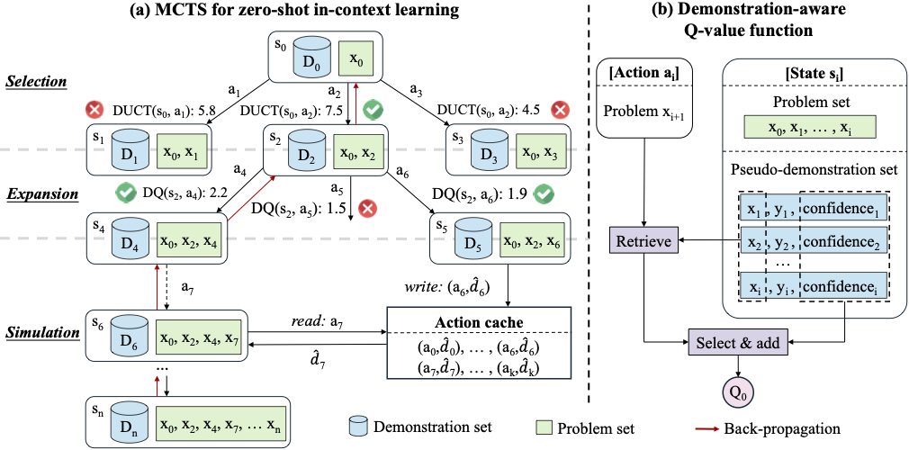

# DAWN-ICL: Strategic Planning of Problem-solving Trajectories for Zero-Shot In-Context Learning

## 😀 Overview

+ We are the first to formalize ZS-ICL as a planning problem, which is closer to real-world scenarios.

+ We propose a novel demonstration-aware MCTS for ZS-ICL to achieve a more effective and efficient search for the problem-solving trajectories.

+ Extensive experiments demonstrate the effectiveness of our approach on in-domain and cross-domain scenarios, and it even outperforms ICL using human-annotated demonstrations.

  

## 🚀 Quick Start

### Requirements

- python == 3.11.9
- pytorch == 2.3.1
- transformers == 4.42.4
- accelerate == 0.33.0
- openai==1.35.14

### Download Models

Download models from huggingface, open the src/utils.py file and update the directory paths in lines 34-41.
